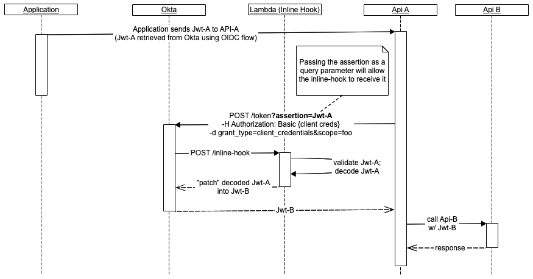

# Implementing OAuth 2.0 "On-Behalf-Of" flow with Inline Hooks
By using [Token Inline Hooks](https://developer.okta.com/docs/reference/token-hook/#see-also), we can be easily extend Okta to model the [OAuth 2.0 On-Behal-Of flow](https://docs.microsoft.com/en-us/azure/active-directory/develop/v2-oauth2-on-behalf-of-flow).

When an API "A" requires a token to access API "B" (under the On-behalf-of flow), it can request the token using client_credentials flow; The request also passes the "assertion" (API "A"'s own JWT, JWT-A) as a query parameter. The inline hook:
* Re-validates the assertion. 
    * This sample is written in Node.js, so we use [Okta's Node.js jwt verifier](https://github.com/okta/okta-oidc-js/tree/master/packages/jwt-verifier)
* Performs custom policy evauation logic
* And if valid, patches the result back to the Auth Server's callback. The [`com.okta.access.patch` command](https://developer.okta.com/docs/reference/token-hook/#sample-response-to-add-a-claim) instructs Okta to extend the client_credentials' JWT with JWT-A's claims.

The diagram below describes the inline hook interaction:

# Setup

## Create the Lambda Function in AWS:
1. Clone this repo, then `npm install`
2. Run `npm run zip`. This generates a zip file in the `/dist` folder. We will need it later.
3. In the AWS Lambda Console:
    * Click **Create Function**
    * Select **Author From Scratch**
    * Runtime = **Node.js**
    * Click **Create Function** (let it automatically create an AMI role, or choose a pre-configured one)
    * In **Code entry type**, select **Upload a .zip file**
    * Upload the `.zip` file in the `/dist` folder generated in previous step.
4. The Lambda uses Okta's jwt verifier library, which requires 2 variables (passed into the Lambda as Environment Variables)... Provide values for 2 environment variables (get these from your Okta configuration):

|Variable|Value|
|--------|-----|
|ISSUER|Issuer String of the Authorization Server configured for API "B" (API "A" makes a client_credentials request to this auth server) e.g. `https://example.okta.com/oauth2/default`|
|AUDIENCE|"Audience" configured in the Authorization Server e.g. `api://default`|

## Create the Inline Hook service endpoint:
Expose the Lambda Function using Amazon API Gateway:
1. From the Amazon API Gateway Console/UI, click **Create API**
2. Accept all defaults, and provide a name for **API name**
3. Click **Create API**
4. On the next screen, click **Actions > Create Resource** and provide following values:
    * Resource name = **inline-hook**
    * Resource Path = **/inline-hook**
    * Click **Create Resource**
    * Click **Create Method**
        * Integration Type = **Lambda Function**
        * Use Lambda Proxy Integration = **Y**
        * Lambda Function = **The Lambda function we just created**
        * Click **Save**

## Setup Inline Hook
[Follow this guide](https://developer.okta.com/docs/concepts/inline-hooks/#inline-hook-setup) to complete the Okta Inline Hook setup.